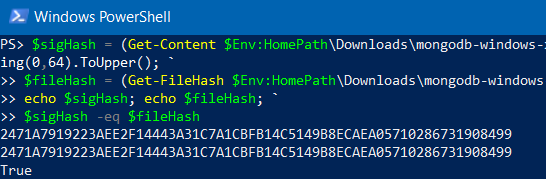
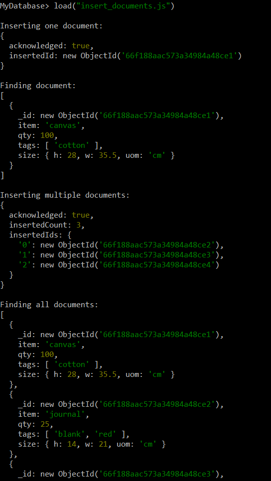
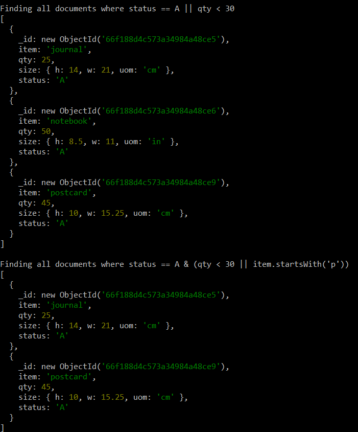
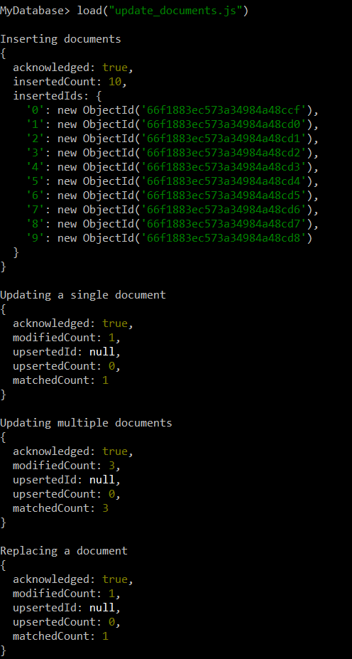
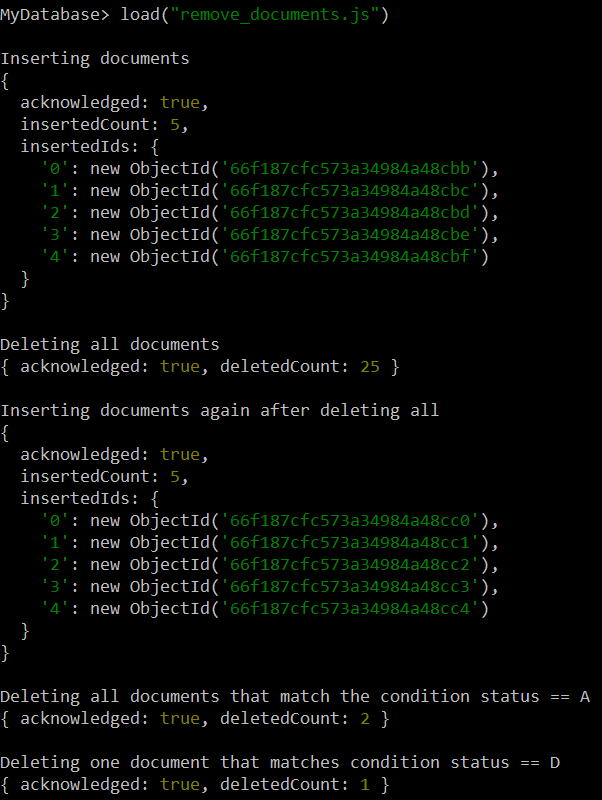
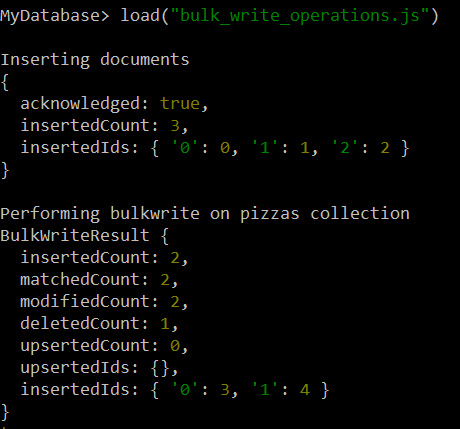
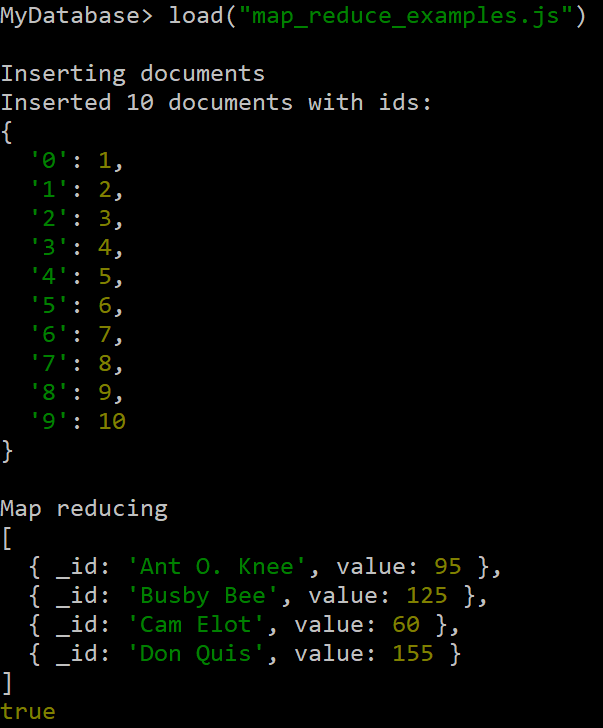

# Assignment 5 - Mongo DB
## Technical problems
I encountered some technical problems during this assignment with mongodb versions. When I was following the versions for experiment 1 the documentation was for v7.0 so that is the version I worked with first and it went fine doing those experiments. When I came to experiment 2 with mapReduce() I found out that the function is deprecated since v5.0 so it no longer worked with the version I had installed. To get that working I had to change over to v4.4 and it worked, but then all the code I had written following the previous experiments didn't provide the right results so I had to change back to v7.0 to take a screenshot of them.

## Screenshots
### Validation

### Insert
 
### Query

### Update

### Remove
 
### Bulk Write
 
### Map Reduce

#### Why is map reduce useful?
Map reduce is a useful operations because it can take large volumes of data and condense it into smaller aggregated results. With the collection used in experiment 2, I used `mapReduce()` to aggregate each customer based on their `cust_id` and get the total amount of `price` for each customer. With this it's a lot easier to see the total amount of money a customer has spent.

## Pending issues
There are no pending issues that I didn't manage to solve.